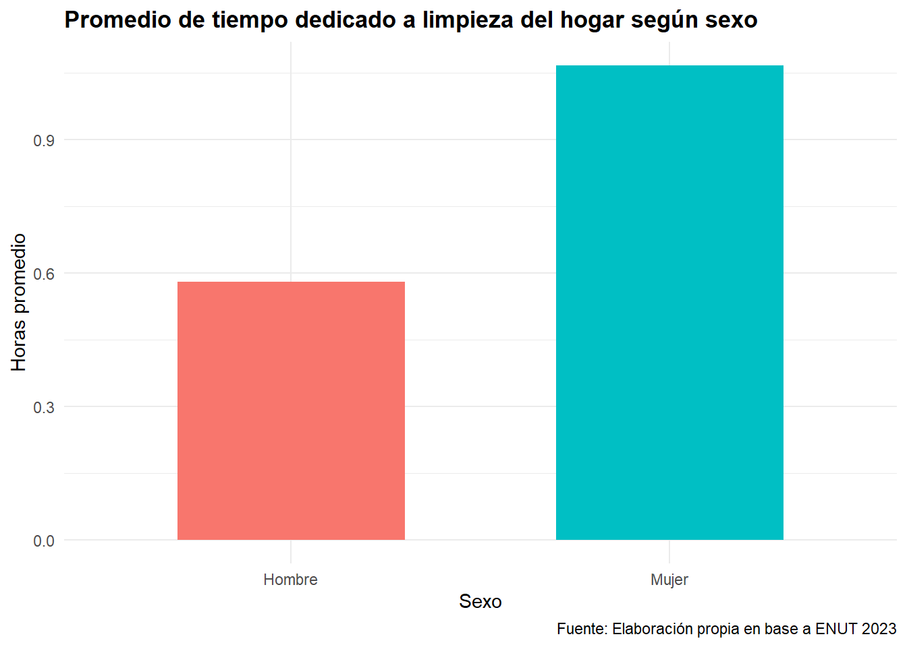
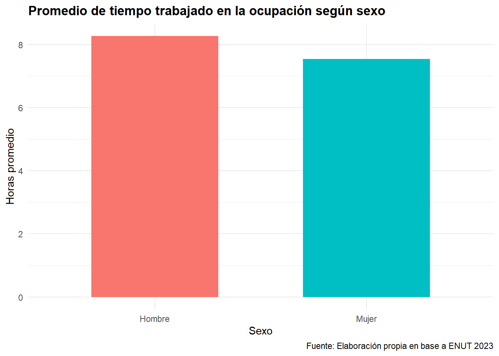
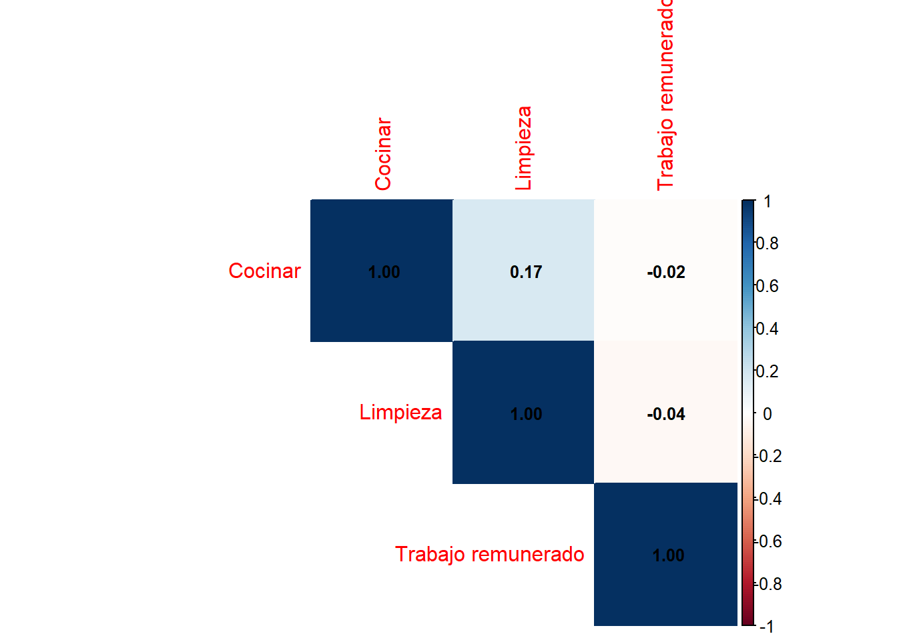
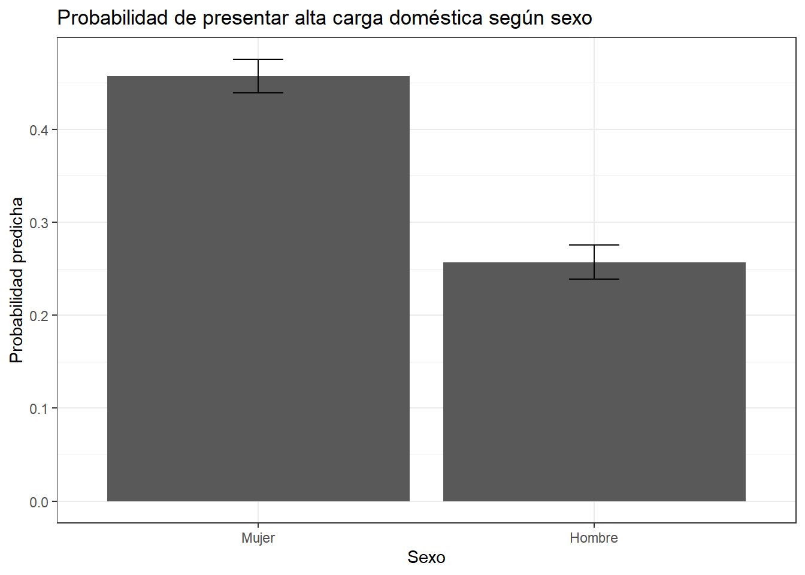

## ¿Existen diferencias de género en la distribución del trabajo doméstico y del trabajo remunerado en Chile?

::::: columns

::: {.column width="50%"}
- Persistencia de la división socio-sexual desigual del trabajo.

- Incorporación creciente de mujeres al mercado laboral
:::

::: {.column width="50%"}
- Existencia de una "doble jornada", incluso hasta tirple
:::
:::::

La incorporación de las mujeres al empleo remunerado no ha sido acompañada por una redistribución equivalente de las tareas domésticas.

--------------------------------------------

## Variables utilizadas

Fuente de datos: ENUT 2023

::::: columns

::: {.column width="50%"}
Dependiente: 

- Indice de carga doméstica. 

:::

::: {.column width="50%"}

Independiente: 

- Sexo

- Horas de trabajo remunerado

- Percepcion de carga doméstica

:::
:::::

------------------------------------------

## Resultados Descriptivos 

## Resultados Descriptivos 

## Asociación entre variables

::::: columns

::: {.column width="60%"}

:::

::: {.column width="40%"}
Resultado principal

- Cocinar y limpieza presentan la asociación más fuerte.

- Las actividades domésticas tienden a concentrarse en las mismas personas. 

:::
:::::

## Probabilidades predichas por sexo

::::: columns

::: {.column width="70%"}

:::

::: {.column width="30%"}

El sexo como principal predictor de la carga doméstica. 

Las mujeres tienen aproximadamente 2,4 veces más
:::
:::::

## Conclusiones 

- Persisten desigualdades de género en la distribución del trabajo doméstico

- La inserción laboral femenina no elimina la carga doméstica

- El sexo es el principal factor asociado a la alta carga doméstica
